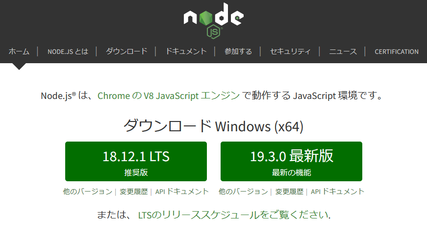

# Vue の使い方トレーニング

このリポジトリでは vue の使い方を学ぶことができます。

vue を使ってどんなことができるのか、実際にコードを書きながら体験していきましょう。

---

## Vue を使っていくうえで必要になるもの

- ## [node.js](https://nodejs.org/ja/)
  
  `18.12.1LTS`をダウンロードすると良いです。(2022/12/16 執筆現在)

node.js をインストールしたらパッケージマネージャーをアップデートする必要があったりなかったりするのでバージョンを確認して

```
npm --version
```

アップデートを行いましょう。

```
npm update -g npm
```

コマンドプロンプトでカレントディレクトリを`vue-trainning`にし
パッケージをダウンロードしてビルド。
```
npm install

npm run dev
```

開発サーバーをたてることができます。

---

## vue でよく使うもの

- ”Mustache” 構文(二重中括弧) `{{ message }}` (基本のき)
- v-for (使いまわしするとき)
- v-if (条件付きで表示するかしないか)
- v-bind (style を script から参照)
- v-on (よく使う(使わない))
- @click (on.click の完全上位互換)
- v-model (フォーム作るときに必須になる奴)
- コンポーネントを呼び出す (パーツの呼び出し)
- 簡易的なコンポーネント間のデータの受け渡し (パーツ間で値を受け渡す)

他にも様々な機能がありますが

これらは Vue を使って開発していく中でも**特に重要**なものなので使えるようになって欲しい。(切実)
