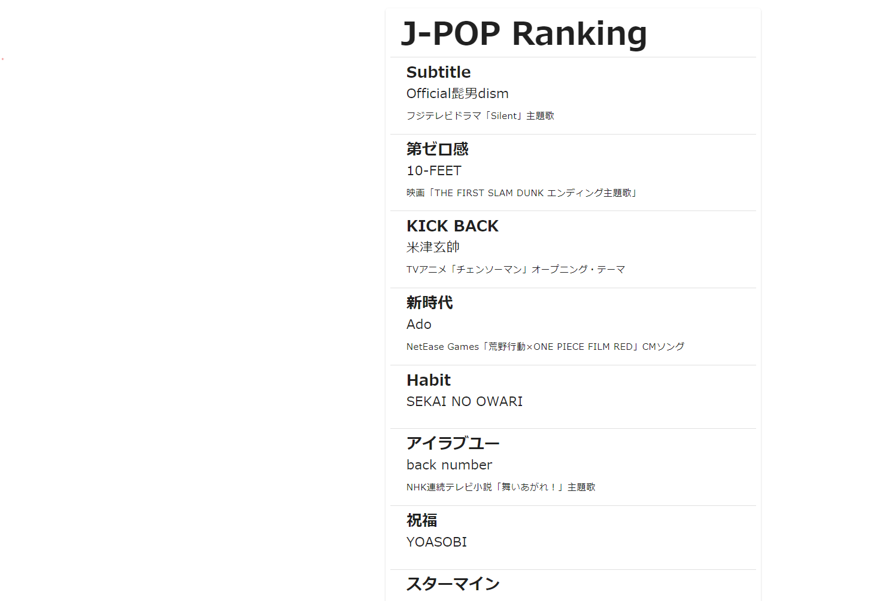

# v-forを使おう

## v-forとは

簡単に言うと、**htmlのfor文**です。

たとえば、以下のようなhtmlがあったとします。

```html
<body>
  <div>
    安藤
  </div>
  <div>
    伊藤
  </div>
  <div>
    武藤
  </div>
</body>
```

このコードを`v-for`を使うことで下のコードのようにかきかえることができます。

```html
<script setup>
  const UserData = [
    "安藤",
    "伊藤",
    "武藤"
  ]
</script>

<template>
  <div v-for="Name in UserData">
    {{ Name }}
  </div>
</template>
```

今回の例ではとても簡単な例なので、「普通に書いたほうが早いんじゃないの？？」
と思う方もいるかもしれませんが、以下のようなデータを表示する必要があったときはどうなるでしょう。

<!-- mdでテーブルを表示 -->
| 名前 | 年齢 | 性別 |
| ---- | ---- | ---- |
| 安藤 | 22 | 男 |
| 伊藤 | 21 | 女 |
| 武藤 | 22 | 男 |
| 田中 | 23 | 男 |
| 鈴木 | 22 | 男 |
| 佐藤 | 21 | 女 |

頑張ればできなくはないと思いますが
htmlで書こうと思うと結構大変ですよね。

vueの`v-for`を使うと、以下のようにかけます。

```html
<script setup>
  const UserData = [
    { name:"安藤", age:22, sex:"男" },
    { name:"伊藤", age:21, sex:"女" },
    { name:"武藤", age:22, sex:"男" }//...略
  ]
</script>

<template>
  <div v-for="user in UserData">
    <div>名前: {{user.name}}</div>
    <div>年齢: {{user.age}}</div>
    <div>性別: {{user.sex}}</div>
  </div>
</template>
```

こんな感じでスッキリした感じで書けるわけですね。
早速使ってみましょう。

---

### お題

サンプルを元に。下の写真のようなページを作成してみてください。



```javascript

const SongData = [
  {title:"Subtitle", artist:"Official髭男dism",description:"フジテレビドラマ「Silent」主題歌"},
  {title:"第ゼロ感", artist:"10-FEET",description:"映画「THE FIRST SLAM DUNK エンディング主題歌」"},
  {title:"KICK BACK", artist:"米津玄帥",description:"TVアニメ「チェンソーマン」オープニング・テーマ"},
  {title:"新時代 [ウタ from ONE PIECE FILM RED]", artist:"Ado",description:"NetEase Games「荒野行動×ONE PIECE FILM RED」CMソング"},
  {title:"Habit", artist:"SEKAI NO OWARI",description:""},
  {title:"アイラブユー", artist:"back number",description:"NHK連続テレビ小説「舞いあがれ！」主題歌"},
  {title:"祝福", artist:"YOASOBI",description:""},
  {title:"スターマイン", artist:"Da-iCE",description:""},
  {title:"色彩", artist:"yama",description:"TVアニメ「SPY×FAMILY」第２クールエンディング主題歌"},
  {title:"妖", artist:"福山雅治",description:"日本テレビ系日曜ドラマ「invert 城塚翡翠 倒叙集」／「霊媒探偵・城塚翡翠」主題歌"},
]

```

```html
<template>
  <v-card class="d-block pa-2">
    <v-card-title class="d-block">
      <h2 class="headline mb-0 text-h3 font-weight-black">J-POP Ranking</h2>
    </v-card-title>
    <v-divider></v-divider>
    <div>
      <v-card flat class="mx-2">
        <v-card-title primary-title>
          <div>
            <h3 class="headline mb-0">曲名</h3>
            <div>アーティスト名</div>
          </div>
        </v-card-title>
        <v-card-text>
          曲の説明
        </v-card-text>
      </v-card>
      <v-divider ></v-divider>
    </div>
  </v-card>
</template>
```
